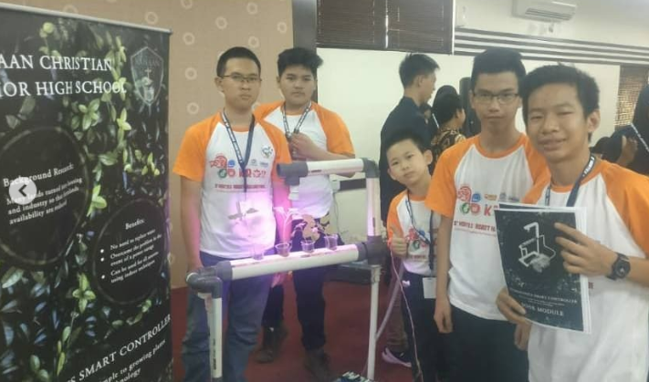
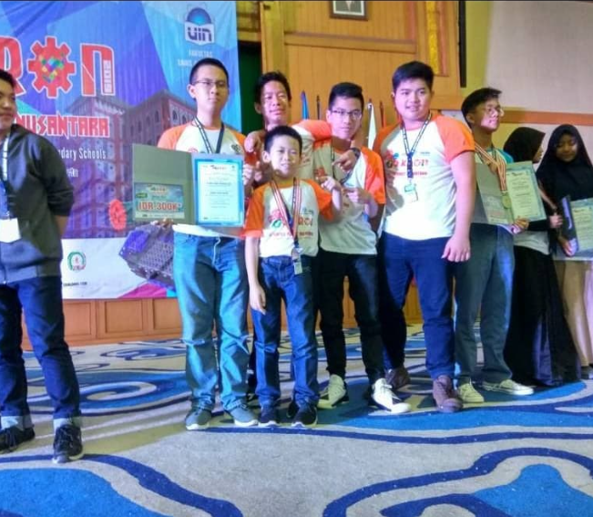
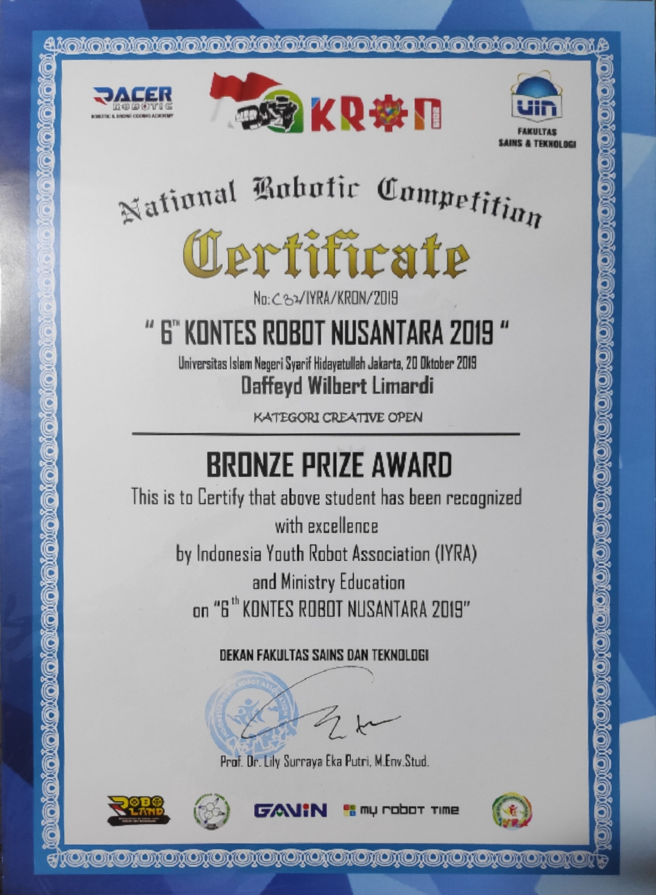

# Hydroponic Smart Controller
This project help you to make a hydroponic farming system run automatic. This system can add some water, fertilizer, and it can turn on UV light, this system also has some button to switch the mode you are using, like outdoor or indoor. This Project is using the Arduino with the ESP01 to connect with the Wi-Fi. All of the data that collected from system like water level, fertilizer concentration will be shown in Blynk application in android

---

### Table of Contents

- [Description](#description)
- [Documentation](#documentation)
- [Author Info](#author-info)

---

## Description

This project is using the Arduino Mega and ESP101 to connect to the internet. Blynk server is use to store data or even control some feature in the hydroponic system if there is any error in the system. This project has no video demo, it's my first project and all the file was gone, if you're interested in this project feel free to get in touch with me with email or instagram below.
#### Technologies

- ESP01
- Blynk API 

[Back To The Top](#hydroponic-smart-controller)

---

## Documentation

This is the project prototype at competition stage

The first project got second runner-up place in national competition

[Back To The Top](#hydroponic-smart-controller)

---
## Author Info

- Instagram - [daffeydwilbert](https://www.instagram.com/daffeydwilbert/)
- Email - daffeydwilbert@gmail.com

[Back To The Top](#hydroponic-smart-controller)

